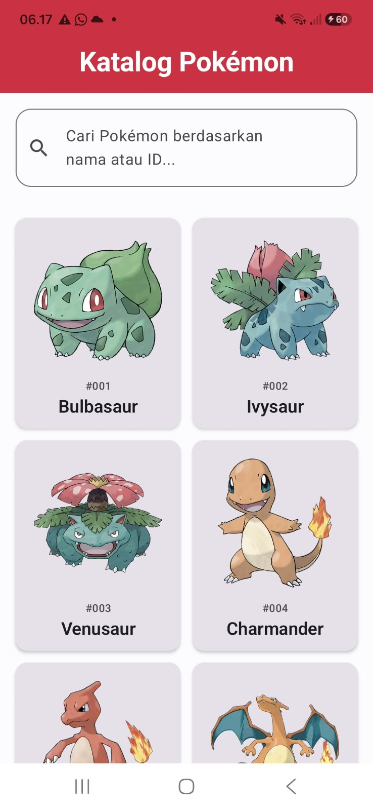
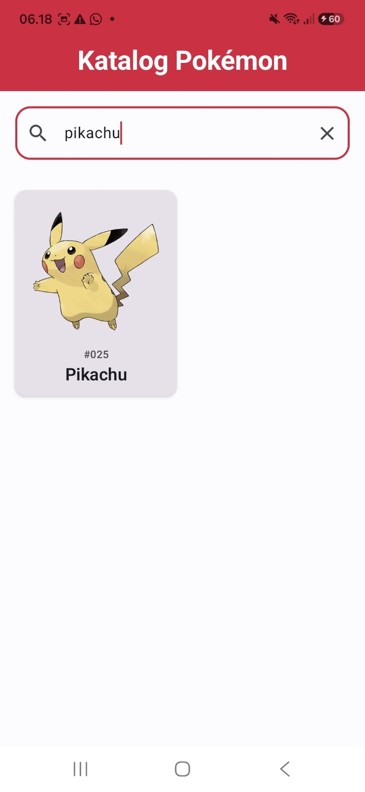

# Katalog Pokémon
> Katalog dan Eksplorasi Pokémon berbasis PokéAPI

---

## 👤 Identitas Praktikan
- **Nama Lengkap:** Wakhid Nugroho
- **NIM:** H1D024003
- **Shift Awal:** Shift H
- **Shift Akhir:** Shift C
- **Link Video Demo/Penjelasan:** https://youtu.be/vXOJy5dYlBk?si=MjGRyJBK4IFESAzV 

---

## 📱 Deskripsi Aplikasi
Katalog Pokémon adalah aplikasi mobile Android untuk mencari, melihat, dan mengeksplorasi informasi Pokémon secara praktis. Pokémon memiliki banyak karakter dengan jenis, statistik, dan karakteristik yang berbeda-beda, sehingga pengguna membutuhkan cara yang mudah untuk menemukan informasinya lewat perangkat mobile. Aplikasi ini mengambil data secara dinamis dari REST API [PokéAPI](https://pokeapi.co/) (tanpa API key), menampilkannya dalam bentuk grid, dan menyediakan fitur pencarian berdasarkan nama atau ID serta halaman detail yang berisi tipe, tinggi, berat, dan statistik. Target penggunanya adalah penggemar Pokémon, pemain game, dan siapa pun yang ingin mencari data Pokémon dengan cepat.

---

## 🛠️ Penjelasan Teknis

### 1. Spesifikasi & Tech Stack
- **Bahasa:** Kotlin 2.2.10
- **UI Framework:** Jetpack Compose (Material 3)
- **Min SDK:** 24 | **Target SDK:** 37
- **Pola Arsitektur:** MVVM (Model-View-ViewModel) dengan Repository Pattern
- **Library Utama:**
    - `Navigation Compose` (Routing halaman Home dan Detail)
    - `ViewModel` & `StateFlow` (State Management, di-collect dengan `collectAsStateWithLifecycle`)
    - `Retrofit` + `Gson Converter` + `OkHttp Logging Interceptor` (Networking / REST API)
    - `Coil` (Image Loading)
    - `Kotlin Coroutines` (Asynchronous processing)

### 2. Fitur Utama
- **Daftar Pokémon (Home Screen):** Menampilkan Pokémon dalam `LazyVerticalGrid` dua kolom. Setiap kartu (`PokemonCard`) berisi gambar official artwork, ID (format `#001`), dan nama. Data diambil dari endpoint `GET /pokemon` melalui `HomeViewModel` dan `PokemonRepository`, lalu diubah menjadi `HomeUiState`. Grid memakai `key` berupa ID Pokémon agar recomposition efisien.
- **Pencarian:** Pengguna dapat mencari berdasarkan nama atau ID. Teks pencarian disimpan sebagai `StateFlow` di ViewModel, lalu digabung dengan daftar Pokémon menggunakan `combine()` untuk menghasilkan daftar yang sudah difilter. Setiap ketikan memicu recomposition hanya pada bagian UI yang bergantung pada state tersebut. Jika tidak ada hasil, ditampilkan `EmptyView`.
- **Detail Pokémon (Detail Screen):** Menampilkan gambar besar, nama, ID, tipe (`TypeChip` berwarna sesuai tipe), tinggi (m), berat (kg), statistik dasar (`StatBar` dengan animasi), dan kemampuan (abilities). Data diambil dari endpoint `GET /pokemon/{name}` lewat `DetailViewModel`, yang menerima nama Pokémon dari argumen navigasi melalui `SavedStateHandle`.
- **Loading & Error State:** UI berubah sesuai sealed interface `UiState` (`Loading`, `Success`, `Error`) menggunakan `when`. Saat gagal memuat (misalnya tidak ada internet), pengguna melihat pesan error dan tombol "Coba Lagi" untuk memanggil ulang API.
- **Tema Material 3 & Dark Mode:** Menggunakan palet warna custom bertema Pokédex, Typography custom, dan dukungan dark mode.

### 3. Struktur Direktori Proyek
```text
app/src/main/java/[package/aplikasi/kamu]/
├── data/
│   ├── model/        # Data class response API & model UI (Pokemon, PokemonDetail)
│   ├── remote/       # PokemonApiService (Retrofit) & ApiClient
│   └── repository/   # PokemonRepository & Resource (penanganan sukses/error)
├── ui/
│   ├── components/   # Composable reusable (PokemonCard, TypeChip, StatBar, SearchBar, LoadingView, ErrorView, EmptyView)
│   ├── home/         # HomeScreen + HomeViewModel + HomeUiState
│   ├── detail/       # DetailScreen + DetailViewModel + DetailUiState
│   ├── navigation/   # AppNavigation & route Screen
│   └── theme/        # Color, Type, Theme, TypeColors Material 3
├── util/             # Extension function (capitalizeFirst, toPokemon, toPokemonDetail, dll.)
└── MainActivity.kt
```

---

## 📸 Tangkapan Layar (Screenshots)

|     Screen 1      |      Screen 2       |         Screen 3          |
|:-----------------:|:-------------------:|:-------------------------:|
|  |  |  |

---

## 🚀 Cara Menjalankan Proyek

1. **Prasyarat:**
    - Android Studio (Koala / Ladybug / versi terbaru disarankan).
    - JDK 17 atau lebih baru.
    - Perangkat fisik Android dengan USB Debugging aktif atau Emulator (API level disesuaikan).
    - Koneksi internet aktif (data diambil dari PokéAPI).

2. **Langkah:**
```bash
   # Clone repository
   git clone https://github.com/wakhid3273/Responsi-PraktikumPemmob-PaketPokemon-Wakhid-Nugroho-H1D024003
```
3. Buka folder proyek di **Android Studio**.
4. Tunggu proses **Gradle Sync** selesai.
5. Pilih target perangkat/emulator, lalu klik tombol **Run (`Shift + F10`)**.